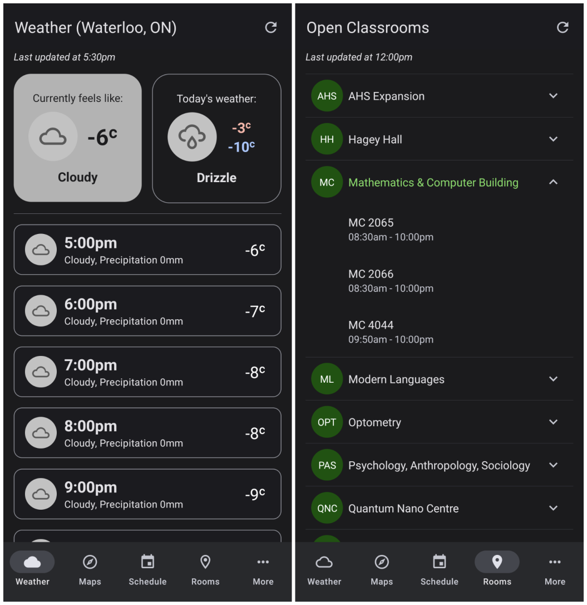

# UWaterloo Hub

UWaterloo Hub is an unofficial React Native app that provides important day-to-day information to students. 

Currently, weather and open classroom data is completed. We plan on adding maps and a schedule view.

## Weather Notes

- Thank you to [Open-Meteo](https://open-meteo.com/) for the weather data
- All temperatures are the "Feels like" value
